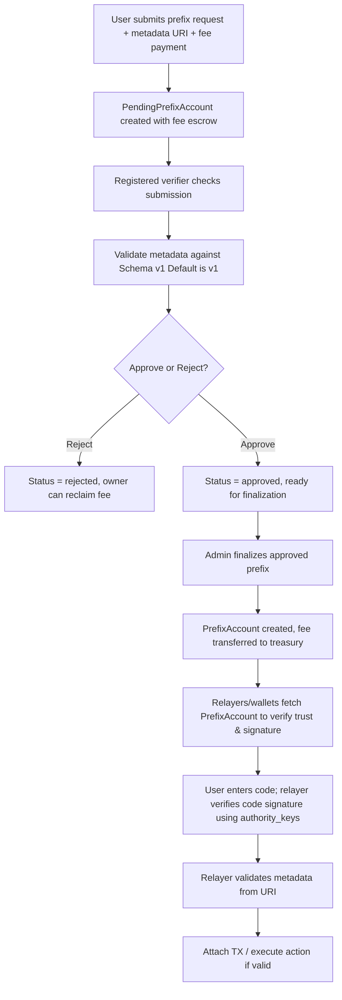

## Overview

This AIP defines prefixes in the Action Codes Protocol as a trust layer enabling branded, verifiable, and auditable prefixes while keeping user UX simple (prefixless codes).

**Key goals:**

- Ensure prefix authenticity and authority verification
- Support manual verification with future DAO/admin automation
- Enable dynamic fees and governance
- Fully cross-chain ready and relayer-agnostic

## Motivation

Prefixes provide namespaces, trust branding, and metadata routing in the Action Codes Protocol:

- Allow apps, wallets, and relayers to verify code authenticity and trust
- Enable branding and metadata routing for organizations
- UX is simple: users enter prefixless codes; prefixes exist only for trust verification
- Fully audit-ready and ready for automation or DAO governance

## Specification

### Prefix Structure

- **Prefix**: 3–12 uppercase alphanumeric characters
- **PendingPrefixAccount**: On-chain escrow for prefix submissions (fee collected at submission)
- **PrefixAccount**: On-chain representation of an approved and active prefix
- **Purpose**: Provide canonical trust for relayers/wallets and link prefix to owner, metadata, and fee reference

#### PendingPrefixAccount Fields

| Field            | Type     | Description                                                              |
| ---------------- | -------- | ------------------------------------------------------------------------ |
| `prefix`         | string   | Uppercase alphanumeric prefix (3–12 chars)                               |
| `owner`          | pubkey   | Main wallet controlling prefix                                           |
| `authority_keys` | pubkey[] | Keys authorized to generate / sign codes for this prefix                 |
| `metadata_uri`   | string   | URI to JSON metadata following Prefix Metadata Schema v1 (Default is v1) |
| `metadata_hash`  | hash     | SHA256 hash of metadata for verification                                 |
| `fee_paid`       | u64      | Fee amount paid in lamports (escrowed)                                  |
| `created_at`     | i64      | Submission timestamp                                                     |
| `expiry_at`      | i64?     | Optional expiry timestamp for auto-rejection                             |
| `status`         | u8       | 0=pending, 1=approved, 2=rejected                                       |
| `auth_ref`       | hash     | Hash of approval record, SAS ref, etc.                                     |
| `bump`           | u8       | PDA bump for on-chain account                                            |

#### PrefixAccount Fields

| Field            | Type     | Description                                                              |
| ---------------- | -------- | ------------------------------------------------------------------------ |
| `prefix`         | string   | Uppercase alphanumeric prefix (3–12 chars)                               |
| `owner`          | pubkey   | Main wallet controlling prefix                                           |
| `authority_keys` | pubkey[] | Keys authorized to generate / sign codes for this prefix                 |
| `metadata_uri`   | string   | URI to JSON metadata following Prefix Metadata Schema v1 (Default is v1) |
| `metadata_hash`  | hash     | SHA256 hash of metadata for verification                                 |
| `auth_ref`       | hash     | Hash of approval record of auth, may be SAS ref, or other auth ref       |
| `status`         | u8       | 0=inactive, 1=active                                                     |
| `created_at`     | i64      | Finalization timestamp                                                   |
| `updated_at`     | i64      | Last update timestamp                                                    |
| `bump`           | u8       | PDA bump for on-chain account                                            |

**Notes:**

- `authority_keys` allow multiple backend servers, relayer programs, or delegated signing keys
- Protocol verifies code signatures against any key in `authority_keys`

### Prefix Registration Flow

#### 1. Submission with Fee Payment

- User submits prefix request and pays fee in the same transaction
- Submission includes:
  - Prefix name (3–12 uppercase alphanumeric)
  - Owner pubkey
  - Metadata URI (JSON following Prefix Metadata Schema v1 (Default is v1))
  - Metadata hash (SHA256 of metadata content)
  - Authority keys (optional initial list)
  - Fee payment (transferred to PendingPrefixAccount escrow)
- Program creates PendingPrefixAccount with status = pending
- Fee is collected immediately to prevent spam

#### 2. Manual Verification

- Only registered verifiers can approve / reject:
  - Check KYC / identity
  - Validate metadata against Prefix Metadata Schema v1 (Default is v1)
  - Validate token / domain ownership if required
  - Verify metadata_uri content matches metadata_hash
- Status updated:
  - `approved`: ready for finalization
  - `rejected`: owner can reclaim fee

#### 3. Finalization (Pending: Active)

- Admin (multisig) finalizes approved pending prefixes
- Program creates PrefixAccount from PendingPrefixAccount data
- Fee transferred from escrow to treasury
- PendingPrefixAccount closed (or archived for audit trail)

#### 4. On-Chain PrefixAccount

- Stores verified prefix \+ ref to approval record
- Authority keys included for code signature verification
- Prefix used only in metadata (`pre=PREFIX`), not shown to end users

### FeeRegistry / FeeSystem

| Field          | Type   | Description                         |
| -------------- | ------ | ----------------------------------- |
| `current_fee`  | u64    | Fee in lamports (SOL smallest unit) |
| `updated_at`   | i64    | Timestamp of last update            |
| `admin`        | pubkey | Admin / DAO wallet pubkey           |
| `bump`         | u8     | PDA bump for on-chain account       |

- Fees can be edited by admin/DAO
- Collected at submission to prevent spam
- Fee is escrowed in PendingPrefixAccount until finalization

### Verifiers List

| Field      | Type   | Description                                  |
| ---------- | ------ | -------------------------------------------- |
| `admin`    | pubkey | Admin wallet controlling verifiers           |
| `verifiers`| pubkey[]| List of authorized verifier pubkeys          |
| `bump`     | u8     | PDA bump for on-chain account                |

- Multiple verifiers possible: consensus-based approval
- Verifiers can approve/reject pending prefix submissions

### Prefix Metadata Schema v1

All prefix metadata must conform to the Prefix Metadata Schema v1, which includes:

**Required fields:**

- `title`: Source of the action request (brand, app, or person) - max 50 chars
- `icon`: HTTP/HTTPS URL to icon image (SVG, PNG, or WebP)
- `description`: Information about the action - max 200 chars
- `label`: Text for user action button (verb \+ max 5 words) - max 30 chars
- `intentCategories`: Array of action categories (payment, stake, vote, etc.)
- `contact`: Flexible contact object with key-value pairs (default required is email)

**Optional fields:**

- `website`: Official website for branding/verification
- `schemaVersion`: Must be "1"

**Contact object example:**

```json
{
  "contact": {
    "email": "support@ota.codes",
    "telegram": "@otacodes", 
    "discord": "otacodes#1234"
  }
}
```

**Schema validation:**

- Verifiers must validate metadata against the canonical schema
- Protocol provides methods to validate metadata against the schema by version (Default is v1)
- Invalid metadata results in rejection with specific error details
- Metadata URI must be accessible and return valid JSON

### Code Usage & Verification

#### User Side

- Users enter prefixless codes (e.g., 12345678)
- Prefix is metadata only for trust verification

#### Relayer / Protocol Verification

1. Fetch PrefixAccount for `pre=PREFIX`
2. Verify:
   - `status = active`
   - Code signature matches any key in `authority_keys`
3. May fetch and validate metadata from `metadata_uri`:
   - Must conform to Prefix Metadata Schema v1 (Default is v1)
   - Verify `icon` URL is accessible and valid format
   - May check provided`intentCategories` match expected action type
4. Optional: relayer-specific checks (domain, registration, SAS)
5. If all checks pass: attach TX / execute action

**Cross-chain ready:** PrefixAccount \+ authority_keys can validate codes from any blockchain relayer

### Security & Anti-Spam

- Fee collected at submission prevents spam (immediate cost)
- Fee escrowed in PendingPrefixAccount until finalization
- Prefixes reserved for branded tokens or businesses require verification
- Only registered verifiers can approve: prevents abuse
- `auth_ref` ensures full auditability
- Supports revocation / deactivation by owner or DAO
- PendingPrefixAccount can have expiry for auto-rejection

### Manual Flow Diagram



## Key Principles

1. **Users never see prefixes**: UX = one-time code entry
2. **Prefix = trust anchor only**: verified by authority_keys
3. **Fee-on-submit**: spam-proof with immediate cost
4. **Manual approval now, scalable to multiple verifiers / attestation services**
5. **Dynamic fees**: anti-spam, flexible governance
6. **Auditability**: auth_ref stores hash of approval record, SAS ref, etc.
7. **Cross-chain ready**: metadata / authority verification works across blockchains
8. **Delegated / multiple authority keys**: future-proof for backend servers and relayer programs

## Notes

- Fully manual for now: future automation is possible with multiple verifiers or attestation services
- Protocol remains chain-agnostic; PrefixAccount \+ auth_ref are canonical trust anchors
- UX is simple: users type code, see trust badge, and confirm transaction
- Fee collected at submission prevents spam and ensures commitment
- PendingPrefixAccount provides escrow and audit trail for submissions
- Supports dynamic fee, revocation, metadata update, and auditability
- Compatible with AIP-1…AIP-5 canonical code formats