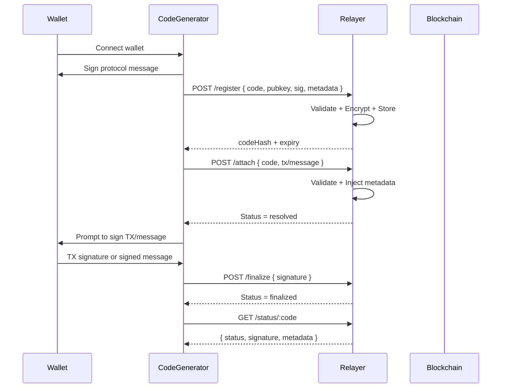

<Tip>Relayer is completely free to use and officially maintained by Action Codes.</Tip>

#### What is the Relayer?

The Relayer is a trusted middleware service that acts as the bridge between users, applications, and the blockchain using the Action Codes Protocol.

It enables:

	*	Secure registration of action codes
	*	Storage of encrypted code state (e.g., pending/resolved/finalized)
	*	Status resolution via code hashes (never raw code)
	*	Code usage verification, metadata injection, and expiration enforcement
	*	Seamless UX with APIs for attaching and finalizing transactions

This allows applications to:

	*	Never store private code values
	*	Use short, secure, and shareable codes
	*	Outsource protocol validation and persistence to a lightweight server

#### Why It Matters

	*	Security: Encrypted code state stored by hash only
	*	Flexibility: Works with any wallet or frontend
	*	Trust Layer: Prevents invalid or spoofed transactions

